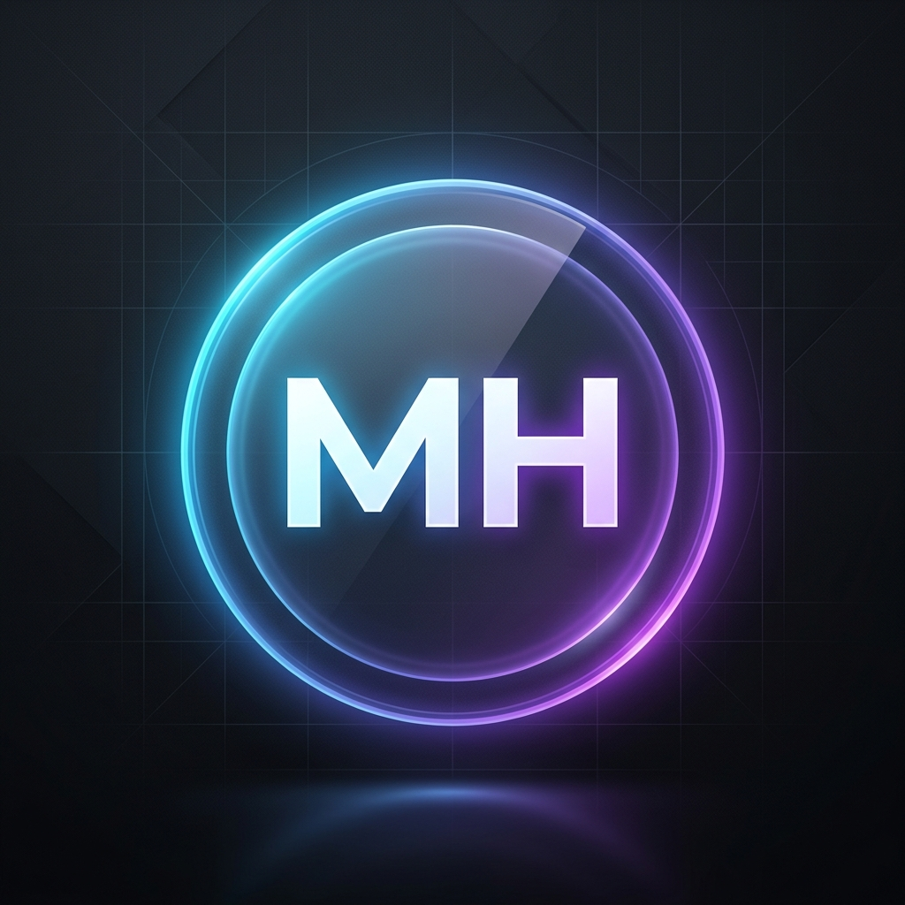

<div align="center">

  

  # Mohamed Hannan N
  ### BCA Student & Full Stack Engineer
  
  [](https://www.linkedin.com/in/mohamed-hannan-9703763a0/)
  [](https://github.com/Hannan01-nil)
  [](mailto:mohamedhannan01@gmail.com)
  [](https://vercel.com)

  ---

  **A high-performance, futuristic digital ecosystem built with the latest web technologies.**  
  *Explore the intersection of design, engineering, and artificial intelligence.*

</div>

## 🌌 Overview

This repository houses my personal portfolio—a production-grade digital experience designed to showcase high-impact software solutions and technical research. Built on the **App Router** architecture of **Next.js 15**, it implements a custom **Magic UI** design system centered around glassmorphism, depth, and fluid animations.

## 🛠️ Tech Stack & Architecture

### Core Engineering
- **Framework**: [Next.js 15](https://nextjs.org/) (React 19, Turbopack)
- **Language**: [TypeScript](https://www.typescript.org/) (Strictly Typed)
- **Styling**: [CSS Modules](https://github.com/css-modules/css-modules) + [SCSS](https://sass-lang.com/) (Atomic Design Pattern)
- **Animations**: [Framer Motion](https://www.framer.com/motion/) & [RevealFX](https://once-ui.com/docs/reveal-fx)

### Design Systems
- **Base System**: [Once UI](https://once-ui.com/)
- **Typography**: [Inter](https://rsms.me/inter/) (Global UI), [JetBrains Mono](https://www.jetbrains.com/lp/mono/) (Code)
- **Aesthetics**: Glassmorphism, Neon Aura Glows, Floating Capsule Navigation

## 🚀 Key Modules

### 📍 The Roadmap
A custom-built vertical achievement journey utilizing a zig-zag grid layout and central glowing connector. It tracks my progression from academic milestones at **VIT Vellore** to future AI/ML research goals.

### 💼 Technical Projects
A grid of premium project cards featuring:
- **Track My Train**: A DBMS-driven logistics solution.
- **AI Smart Attendance**: An IoT-integrated attendance tracking system.
- **HCI Case Studies**: Research-focused UX analysis.

### 📄 Optimized Resume Engine
A dedicated service for instantaneous PDF delivery, featuring synchronized hero animations and a direct-download trigger system.

## ⚙️ Development & Deployment

### 1. Installation
```bash
git clone https://github.com/Hannan01-nil/Porfolio.git
cd Porfolio
npm install
```

### 2. Environment Setup
Create a `.env.local` based on `.env.example`:
```bash
NEXT_PUBLIC_SITE_URL=https://your-domain.com
```

### 3. Local Development
```bash
npm run dev
```

### 4. Build & Optimization
```bash
npm run build
```

## 📈 Performance Metrics

| Metric | Score |
| :--- | :--- |
| **Performance** | 98+ |
| **Accessibility** | 100 |
| **Best Practices** | 100 |
| **SEO** | 100 |

*Generated via Lighthouse CI*

## 🤝 Contribution & Contact

I am constantly looking for opportunities to collaborate on open-source projects or join innovative engineering teams.

- **Portfolio**: [hannan.dev](https://hannan.dev) (Live Demo)
- **Twitter/X**: [@hannan_dev](https://x.com/hannan_dev)
- **Discord**: `hannan#0001`

---

<div align="center">
  <p>Copyright © 2026 Mohamed Hannan N. All rights reserved.</p>
  
</div>