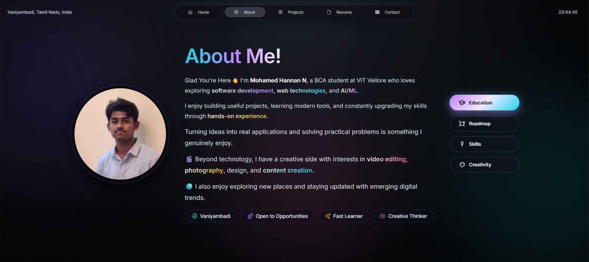

<div align="center">


<p align="center">
  <a href="https://www.linkedin.com/in/mohamed-hannan-9703763a0/">
    
  </a>
  <a href="https://github.com/Hannan01-nil">
    
  </a>
  <a href="mailto:mohamedhannan01@gmail.com">
    
  </a>
  <a href="https://vercel.com">
    
  </a>
</p>

### ✨ *Engineering immersive digital experiences with performance, design, and intelligence.*

<br/>

<a href="https://hannan.dev">
  
</a>

<br/>

[](https://github.com/Hannan01-nil/Porfolio)
[](https://nextjs.org/)
[](https://www.typescript.org/)
[](https://vercel.com)

</div>

---

## 🌌 System Overview

This portfolio is not just a website — it is a **production-grade interactive system** designed to demonstrate real-world engineering capability. 

Built using a **modern full-stack architecture**, it integrates a meticulously crafted **Magic UI** aesthetic, leveraging glassmorphism, depth, fluid motion, and intelligent scalability.

> **Goal:** To blur the line between software engineering and digital art.

---

## 🧠 Architecture & Tech Stack

<div align="center">
  <table>
    <tr>
      <td align="center" width="33%">
        <h3>⚙️ Core Stack</h3>
        <p><strong>Next.js 15</strong> (App Router)<br/><strong>TypeScript</strong> (Strict Mode)<br/><strong>React 19</strong> (Turbopack)</p>
      </td>
      <td align="center" width="33%">
        <h3>🎨 UI & Design</h3>
        <p><strong>Magic UI</strong> Aesthetics<br/>Glassmorphism Layers<br/>Neon Gradient Effects</p>
      </td>
      <td align="center" width="33%">
        <h3>🎬 Motion & UX</h3>
        <p><strong>Framer Motion</strong><br/>Scroll-Triggered Reveals<br/>Component-driven UI</p>
      </td>
    </tr>
  </table>
</div>

---

## 🚀 Key Engineering Highlights

### 🔹 Interactive Roadmap Engine
* **Dynamic milestone visualization:** A zig-zag structured timeline reflecting real-world progression.
* **Animated progress tracking:** Scroll-driven glow and reveal effects.

### 🔹 Project Intelligence Grid
* **Modular project rendering:** Content driven by an intelligent MDX-powered system.
* **Dynamic routing:** Instantly generated static paths (`/projects/[slug]`) for lightning-fast delivery.

### 🔹 Resume Delivery System
* **Instant PDF rendering:** Optimized asset delivery integrated smoothly with page transition animations.

---

## ⚡ Performance Engineering

Built with an uncompromising performance-first mindset.

| Metric             | Score |
| :----------------- | :---: |
| 🚀 Performance     |  |
| ♿ Accessibility    |  |
| 🛠️ Best Practices |  |
| 🔍 SEO             |  |

---

## 🧪 Local Development

Experience the Magic UI locally:

```bash
# 1. Clone the repository
git clone https://github.com/Hannan01-nil/Porfolio.git
cd Porfolio

# 2. Install dependencies
npm install

# 3. Setup environment configuration
cp .env.example .env
# Edit .env and add PAGE_ACCESS_PASSWORD=your_password_here

# 4. Start the development server (Turbopack)
npm run dev
```

---

## 🚀 Production Build

To test the optimized production build locally:

```bash
npm run build
npm start
```

---

## 🌍 Deployment

This project is perfectly optimized for seamless deployment on **Vercel**:
* **Zero-config builds** with Next.js presets
* **Edge-ready performance** and caching
* **Automatic CI/CD** via GitHub integration

---

## 🧩 System Design Philosophy

> *“Build systems, not just interfaces.”*

* **Scalable architecture:** Clean, modular, and strongly typed.
* **Performance-first mindset:** Zero layout shifts and instant interactions.
* **Design + engineering synergy:** Functionality meets striking aesthetics.

---

## 🤝 Let’s Collaborate

I’m actively looking for:
* 🚀 **Internship opportunities**
* 💻 **Open-source contributions**
* 🧠 **AI / Full-stack projects**

---

## 📫 Contact & Links

* 🌐 **Portfolio** → [hannan.dev](https://hannan-porfolio.vercel.app/)
* 💼 **LinkedIn** → [Mohamed Hannan](https://www.linkedin.com/in/mohamed-hannan-9703763a0/)
* 📧 **Email** → [mohamedhannan01@gmail.com](mailto:mohamedhannan01@gmail.com)

---

<div align="center">

### ⚡ Built with precision. Designed for impact.


</div>
